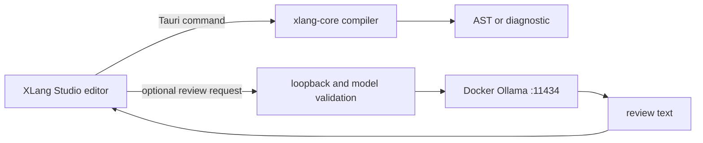

# Architecture

## Compiler Boundary

`xlang-core` is a dependency-free Rust crate. The CLI and Studio shell are thin
adapters over it, so all compiler validation follows one code path. The compiler
does not use an AI model, JavaScript evaluation, network access, or persistent
state.

## Desktop Boundary

Studio is a Tauri 2 desktop app. Its React renderer holds the current document;
the native command layer performs compilation and optional Ollama HTTP calls.
The renderer cannot select a remote endpoint: `XLANG_OLLAMA_URL` is parsed in Rust
and accepted only when it is loopback HTTP without credentials, query data, or a
non-root path.

## Data Storage

Studio stores the editor buffer and selected model in WebView local storage. The
keys are `xlang.source` and `xlang.model`. This supports reopening the app without
introducing an account, server database, telemetry pipeline, or cloud sync.

## Local Model Selection

The status command reads `/api/tags` from Docker Ollama and fills the selector with
installed local models. `qwen2.5:3b` is the fallback and initial preference. A
review request uses `/api/chat` with streaming disabled and a bounded source
payload, returning plain reviewer text to the desktop UI.
