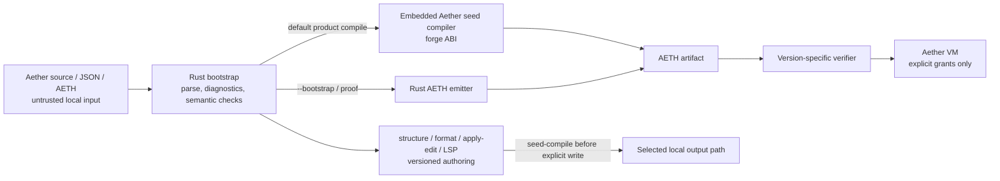

# Aether / XLang — Comprehensive Project Progress Report

```text
Document: Comprehensive Project Progress Report
Status: Current, evidence-led Level 4 product record
Date: 2026-08-08
Repository: XLang (Aether product workspace)
Source snapshot: 89a71c4c9b7272bbd1a14f0f440aa9d8ed56b910
Product delivery commit: 3e3e85b4c5215790c527051fc4cc782abec89f33
Branch: codex/xlang-local-first-studio (pushed and tracking origin)
Current product package: aether-core / aether-cli 0.36.0
Language contract: Aether 0.11 plus bounded M19e task-frame forms
Artifact contract: AETH v4–v12 input; v11 or v12 current output
Authoring contract: aether.ast/v8, aether.edit/v8, aether.diagnostic/v8
Preview channel: local folder only, UNLICENSED; not a public release
Authority: AGENTS Constitution, MANIFEST.md, CORE_CLAIMS.md, current contracts,
  ADRs, validation matrices, and delivery reports
Related rules: CONST-GATE-001, CONST-DONE-001, CONST-COMPLETE-001,
  ENG-WARN-001, TEST-BEHAVIOR-001, DOC-SYNC-001, SEC-INPUT-001,
  RND-INVAR-001, IP-INVENTION-001, REL-PACKAGE-001, REV-PACK-001
Supersedes: the prior 0.36 working-tree snapshot of this report
```

---

## Executive position

**Aether is a real, locally usable compiler-and-VM toolchain pilot—not a
general-purpose 1.0 language and not a replacement claim for Rust, C++, Go,
Java, Python, TypeScript, or any other language.** It parses Aether source,
emits Aether-owned **AETH** bytecode, verifies the bytecode, and executes it in
the Aether VM. It does not transpile guest source to Rust, C, JavaScript, LLVM,
or another host language.

The project has moved well beyond a language sketch. Package **0.36.0** has a
seed-hosted default compiler path; a Rust bootstrap for rebuilding, diagnostics,
and proof; a versioned bytecode verifier/VM; bounded resources, errors,
comptime, layouts, concurrency, capabilities, and foreign interop slices;
offline projects/workspaces/testing/LSP; and an AI-oriented structural authoring
protocol. It is shipped as a **local technical-preview package** with exact
checksums and an independent consumer verifier.

The project is deliberately strongest where it is most differentiated:

1. **Deterministic, verifier-first execution.** AETH is checked before run and
   before forge output is written.
2. **Explicit authority.** Guest programs receive no ambient filesystem,
   process, shell, network, registry, or model authority.
3. **Evidence-led self-hosting.** The Aether-written seed compiler is the
   default product compiler for its documented surface, with byte-identity
   proof against bootstrap compilation for a defined corpus.
4. **AI-primary authoring without model authority.** Structured AST,
   diagnostics, and bounded edits make tooling output inspectable and
   revalidated; no model service has compilation or persistence authority.
5. **Narrow, executable claims.** Each implemented slice has a contract,
   ADR, validation matrix, negative tests, and stated non-goals.

The project remains early relative to the mature ecosystems it studies. It has
no general generics, package registry, native backend, broad FFI, parallel task
runtime, large standard library, public package channel, distribution license,
or consumer ecosystem. Those are not hidden deficiencies; they are explicit
future programs with law, security, and proof gates.

### One-page truth table

| Surface | Current truth | Important boundary |
| --- | --- | --- |
| Aether source → AETH → verify → VM | **Implemented and locally usable** | Aether-only VM execution; no source transpilation. |
| Seed-hosted default compilation | **Proven for the documented corpus** | Rust bootstrap remains invalid-source diagnostic and seed-rebuild authority. |
| AETH compatibility | **v4–v11 historical inputs retained; v12 implemented** | New task source emits v12; non-task source remains v11. |
| Structural authoring | **Implemented, v8** | Bounded semantic AST/edit/diagnostic protocol; not arbitrary AST mutation or an AI service. |
| Projects, modules, workspaces, locks | **Implemented, offline and local-first** | No registry, URLs, remote cache, solver, or publication workflow. |
| Test runner and LSP | **Implemented, bounded and offline** | LSP is not a second compiler and does not emit AETH. |
| Host I/O | **Implemented under explicit grants** | No ambient guest I/O, process, shell, or network. |
| Foreign ABI | **Implemented Whole-only pilot** | Operator-granted native library is not sandboxed or memory-safe by claim. |
| M19e task-frame cancellation | **Implemented, verifier-checked v12 slice** | Cooperative checkpoints only; no handles, timeouts, preemption, nesting, or parallelism. |
| Runtime Text optimization | **Measured on one local self-host workload** | No general VM, cross-machine, Unicode, or competitor-performance claim. |
| Technical-preview package | **Local package verified** | `UNLICENSED`, no public release, tag, installer, signed release, or license grant. |
| “Better than all languages” | **Prohibited claim** | The project may earn scoped comparative claims only through future evidence. |

### How to read this report

Use the sections in this order for the fastest trustworthy picture:

1. **Current contract and evidence** — Sections 1–3 establish what is actually
   built and the source of truth.
2. **Capability map and milestone ledger** — Sections 4–8 show the language,
   compiler, tooling, security, and AI-authoring surfaces.
3. **Proof, performance, and release posture** — Sections 9–13 distinguish
   repeatable evidence from aspiration.
4. **Maturity, risks, and next work** — Sections 14–18 describe what keeps
   Aether from a public 1.0 and what is lawful to do next.

---

## 1. Snapshot control, authority, and claim discipline

### 1.1 Snapshot basis

This report describes the committed source snapshot headed by
`89a71c4`. That merge commit is content-neutral relative to product delivery
commit `3e3e85b`; it preserves an older remote M5/M6 line in history while
retaining the verified Aether 0.36 content. The source branch is pushed, but a
pushed source branch is **not** a public binary release.

The local checkout contains separately uncommitted legacy/root cleanup and
archive files. Those intentionally remain outside this report's product claim,
delivery scope, and source snapshot. They must not be mistaken for part of
Aether 0.36.

### 1.2 Source-of-truth hierarchy

When documents disagree, resolve in this order:

| Priority | Artifact | What it decides |
| --- | --- | --- |
| 1 | AGENTS Constitution and applicable law | Quality, safety, claim discipline, and delivery process. |
| 2 | [MANIFEST.md](../MANIFEST.md) | Executable product boundary, contracts, and release gate. |
| 3 | [AETHER_0.36.md](AETHER_0.36.md) | Current package semantics, compatibility, and explicit non-goals. |
| 4 | [CORE_CLAIMS.md](CORE_CLAIMS.md) | Whether a statement is proven, directional, hypothetical, or prohibited. |
| 5 | Current ADRs, validation matrices, and delivery reports | Design rationale and per-feature proof boundaries. |
| 6 | Historical contracts and roadmaps | Context only; they never silently upgrade current behavior. |

### 1.3 Claim labels used throughout this report

| Label | Meaning in this report |
| --- | --- |
| **Implemented** | Present in the checked-in product and supported by the linked contract/tests. |
| **Proven** | Implemented with explicit evidence such as byte identity, negative verifier tests, or a documented measurement. |
| **Bounded** | True only under the stated types, forms, artifacts, authority model, or corpus. |
| **Design-only / direction** | Valuable plan or accepted decision; not a shipped capability. |
| **Blocked** | Requires a new ADR, threat-model change, explicit human authorization, or Level 4 law fork. |
| **Prohibited** | A statement or feature direction that current project law does not permit. |

This distinction protects the project from a common language-project failure
mode: treating an experimental implementation, a research comparison, or a
roadmap item as an external guarantee.

### 1.4 Product identity

| Field | Current value |
| --- | --- |
| Product name | Aether |
| Repository name | XLang (historical repository identity) |
| Core crate | `aether-core` at `crates/xlang-core`, version 0.36.0 |
| CLI crate / binary | `aether-cli` / `aether`, version 0.36.0 |
| FFI test library | `aether-ffi-pilot`, version 0.36.0, `publish = false` |
| Rust baseline | Edition 2021; workspace `rust-version = "1.88"` |
| Snapshot compiler observed in release evidence | `rustc 1.96.0 (ac68faa20 2026-05-25)` |
| Product compile authority | Aether-written seed artifact embedded in CLI |
| Bootstrap authority | Rust parser/compiler for `check`, diagnostics, seed rebuild, and dual-compare |
| Local package channel | `dist/aether-0.36.0-tp/`, ignored generated output |
| License/distribution state | `UNLICENSED`; no rights or public channel are implied |

---

## 2. Vision and the design philosophy actually implemented

### 2.1 The intended niche

The north star is a **local-first, verifier-first, AI-primary systems language
toolchain**. The intent is not to copy every feature from other languages. It
is to combine their strongest lessons while preserving a small, inspectable
core:

- Rust/Zig-like explicit ownership and systems discipline without ambient
  allocation or hidden control paths.
- Go-like structured task grouping only where lifecycle and deterministic
  cleanup can be checked.
- Capability-security ideas: no ambient authority; host power comes through
  explicit per-invocation grants.
- Compiler/tooling lessons from TypeScript/Rust: stable structural data,
  actionable diagnostics, formatter authority, project awareness, and LSP
  integration.
- Local-first delivery: no cloud model, network registry, web UI, or external
  service sits in the product compiler path.

The authoritative vision is [NORTH_STAR.md](NORTH_STAR.md). It is intentionally
separate from the executable contract so aspiration cannot be presented as
current syntax or behavior.

### 2.2 AI-first means structured, reviewable authorship

AI-first does **not** mean that Aether accepts untrusted model output without
verification. It means the toolchain makes programs safer for AI to produce and
for humans to review:

| Need | Aether mechanism | Boundary |
| --- | --- | --- |
| Stable machine-readable program shape | `aether.ast/v8` | The AST is derived from successfully parsed source; it is not an execution authority. |
| Predictable diagnostics | `aether.diagnostic/v8` codes/spans | Bootstrap diagnostics remain authoritative for invalid source. |
| Safe structural modifications | `aether.edit/v8` typed bounded operations | Full canonical base source, stale-base guard, reparse, semantic validation, seed compile, then explicit output write. |
| Project-aware assistance | Offline `aether lsp` | Stdio only; no disk writes or AETH emission. |
| Provenance | Canonical source → seed artifact → verified AETH chain | No model API, network, or opaque hosted compiler step. |

The current authoring contract is intentionally limited to top-level
declarations and statement-level weave-body operations. It excludes arbitrary
expression-atom surgery, JSONPath mutation, unvalidated free-form edits, and
implicit writes. This is a conscious safety trade-off: narrower edit power makes
negative cases and review boundaries tractable.

### 2.3 Core invariants worth preserving

The current implementation is organized around invariants rather than broad
feature quantity:

1. **AETH-only execution.** Aether source becomes AETH, not generated Rust/C/
   JS/LLVM source.
2. **Verify before run or forge write.** Invalid, unknown, malformed, or
   capability-invalid bytecode does not reach the VM.
3. **Explicit resource ownership.** Arena, Buffer, table, and task-frame
   ownership rules are carried into bytecode planning and verification.
4. **No ambient guest authority.** The default host catalog is pure and small;
   expanded authority is opt-in per CLI invocation.
5. **Seed proof before product authority expands.** A new source form is not
   claimed seed-hosted without a defined corpus and parity evidence.
6. **Versioned contracts.** Artifact and authoring changes are versioned rather
   than reinterpreting old input silently.
7. **Bounded mechanisms over implicit magic.** Fixed comptime budgets, closed
   task admission, limited shape arity, bounded arenas, and explicit writes
   are deliberate design choices.

---

## 3. Current product architecture



### 3.1 Compiler and runtime boundaries

| Layer | Responsibilities | Does not do |
| --- | --- | --- |
| CLI `aether` | Reads selected local files, selects commands/grants, writes only explicit output paths | Does not contact a model, registry, or network. |
| Rust bootstrap | Parse, format, semantic validation, AST/diagnostics, bootstrap compile, seed rebuild, dual-compare | Is not the default product compiler for the documented seed surface. |
| Seed compiler | Aether-written compiler program implementing the forge ABI `compile [borrow source: Text] -> Bytes` | Does not claim full invalid-source diagnostic parity. |
| AETH verifier | Version-specific structural, type/resource/effect/capacity/opcode validation | Does not execute invalid bytecode. |
| VM | Deterministic bytecode execution, pure fixtures, installed grants, task-frame runtime | Does not expose ambient OS authority. |
| Host / forge boundary | Installs pure/granted services after verification and owns host I/O | Does not make guest code trusted. |

### 3.2 Product compile path

For normal compilation, the CLI uses the embedded checked-in seed artifact.
The Rust bootstrap remains essential but has a different role:

| Path | Primary use | Authority statement |
| --- | --- | --- |
| `aether compile` | Default product compilation | Seed-emitted AETH for the documented seed surface. |
| `aether compile --bootstrap` | Proof/comparison and bootstrap authority | Rust output used to establish parity and rebuild the seed. |
| `aether check` | Canonical parse and diagnostics | Bootstrap diagnostic authority; seed parity for invalid input is not claimed. |
| `aether forge` | Run a verified compiler AETH artifact on source | Host verifies compiler and returned AETH before explicit write. |
| `aether apply-edit` | Revalidate structured edits before writing source | Uses canonical bootstrap semantics then seed compilation before output. |

M23 is the careful exception to raw seed source evaluation: the bootstrap
validates/materializes a permitted comptime helper-call result into the existing
literal seed input, then the seed emits a byte-identical artifact. This is a
documented bridge, not a claim that the seed directly interprets arbitrary M23
call syntax.

### 3.3 Artifact formats and compatibility

| AETH generation | Status in 0.36 | Compatibility behavior |
| --- | --- | --- |
| v4–v10 | Historical verified inputs | Accepted under their preserved historical verifier/VM meaning. |
| v11 | Current output for non-task source | Preserves synchronous/cooperative historical nursery semantics and later v11 additions. |
| v12 | Current output for valid M19e task source | Adds task flags, per-frame arena capacity, and `TASK_CHECKPOINT`; verifier rejects v12 task rules in older formats. |

No prior source, AETH artifact, or authoring request is silently upgraded into a
task frame. A source program without `task weave` emits v11. A source program
with a valid task frame emits v12. That split prevents a new concurrency/
destruction model from changing prior programs by accident.

### 3.4 Repository evidence inventory

At this snapshot, the repository contains a substantial, structured evidence
base:

| Evidence class | Count / current state |
| --- | --- |
| Markdown product/research documentation | 220 files under `docs/` |
| ADRs | 42 (`ADR-001` through `ADR-042`) |
| Validation matrices | 32 |
| Delivery reports | 40 |
| Top-level Aether examples | 32 |
| All `.ae` examples including fixtures | 43 |
| Seed source | `seed/aether_seed.ae`, 2,778 lines |
| Checked-in seed artifact | `seed/aether_seed.aeth`, 32,839 bytes |

Counts make no quality claim by themselves. They demonstrate that progress is
recorded through design, tests, contracts, examples, matrices, and delivery
reports rather than a single aspirational README.

---

## 4. Language surface and semantics

### 4.1 Core values, ownership, and records

The language is intentionally small and typed. Its core value surface includes
`Whole`, `Truth`, `Text`, `Bytes`, and immutable nominal records. Ownership is
explicit through `borrow`, `move`, and closed resource operation forms.

| Area | Implemented behavior | Boundary |
| --- | --- | --- |
| Scalars | `Whole`, `Truth`, `Text`, `Bytes` | No general user-defined numeric tower or dynamic object model. |
| Records | Immutable nominal records, construction, field borrow | Primitive fields only; no unrestricted nesting/generic records. |
| Local bindings | Fixed root slots; controlled revision rules | Blocks can revise but do not freely create arbitrary binding shapes. |
| Text / bytes | UTF-8 source, scalar-aware Text semantics, byte primitives | No claim of a comprehensive Unicode libraries ecosystem. |
| Ownership | Copy versus unique owners; explicit borrow/move/access | No hidden garbage collection or ambient allocator model. |

### 4.2 M2 resources and bounded dynamic aggregates

M2 established explicit, capacity-bounded resource ownership:

| Facility | Meaning | Important invariant |
| --- | --- | --- |
| `arena N` | Explicit allocation capability | Header capacity is statically planned and verifier-checked. |
| `buffer Whole` / `buffer Truth` | Mutable aggregate owner | Mutation is through closed outcomes and explicit access. |
| `shape` / `table ... layout rows|columns` | Arena-backed Whole tables | Physical layout is caller-selected; logical semantics are shared. |
| `allocate`, `append`, `at`, `store`, `load` | Closed resource operations | Owners and access loans cannot escape their verified boundary. |

Resource properties are not only parser restrictions. Typed resource facts are
carried into artifact emission and verified before VM execution. Aether does not
claim an ambient, general-purpose allocator, a free list, or unconstrained
resource sharing.

### 4.3 M4 effects and M16 resource/handle boundary

M4 adds one bounded abortive effect: `Error[Whole]`.

| Form | Implemented behavior |
| --- | --- |
| `raises Whole` | Non-`main` weave annotation within a closed parameter/result profile. |
| `raise` / `forward call` | Explicit abortive routes with resource/effect boundary checks. |
| `handle call ... otherwise ...` | Terminal handled route, preserving a visible success/error destination. |
| M16 extension | A total weave may retain live resources across a terminal `handle` of a resource-free copy-only erroring callee. |

The current effect system is intentionally not general exceptions, effect rows,
async exceptions, resumable errors, resource-carrying errors, or arbitrary
cleanup-on-raise. A raise/forward path with incompatible live owners remains
rejected. This keeps failure behavior visible and statically constrained.

### 4.4 M5, M15, and M23 comptime

Comptime is deliberately narrower than macros, unrestricted evaluation, or
compile-time I/O:

| Increment | Current capability | Closed boundary |
| --- | --- | --- |
| M5 (0.8) | Root-level immutable `comptime bind` with one checked `Whole` arithmetic operation | Fixed 1,024-directive budget; no host observation, control flow, recursion, code generation, or mutable state. |
| M15 (0.20) | Prior root-level comptime Whole names can be operands | Still source-ordered, pure, one operation per directive. |
| M23 (0.33) | One restricted call to a textually prior total Whole-only guest helper | Body/arguments are closed; no effect/resource/host/foreign/nursery/control/nested call authority. |

M23 is a substantial design milestone because it proves a controlled way to
reuse pure guest logic at compile time without turning comptime into a second,
ambiently capable runtime. The price is intentional: direct raw-M23 seed
evaluation, recursion, loops, nested calls, new types, and flexible fuel models
require a new ADR and proof program.

### 4.5 M6 layouts

M6 supplies explicit `shape` declarations and Whole tables with `rows` or
`columns` physical layout. The abstraction is deliberately small:

- 1–8 Whole fields per shape.
- Bounded table capacities.
- One logical model despite two physical layouts.
- No automatic layout rewriting, generic shapes, non-Whole fields, or broad ABI
  claim.

This proves an important principle: layout should be explicit, testable, and
semantically equivalent before wider data-layout sophistication is considered.

### 4.6 Concurrency and the M19 resource/effect program

There are three materially distinct concurrency/resource phases. They must not
be collapsed into a blanket “async” claim.

| Slice | What is implemented | What it does not imply |
| --- | --- | --- |
| M7 (v10) | Lexical `together` nurseries; 1–8 spawned children; cooperative source-order execution; first failure cancels unstarted work | OS threads, parallel execution, task handles, nested nurseries, or active-frame cancellation. |
| M19b/M19d (v11) | Parent resource ownership across a nursery under Policy A; multi-weave arena capacity; resourceful total spawn callees under Policy A+; cooperative Policy B bounds | Live resource arguments crossing spawn sites, arbitrary reclamation, mid-frame v11 cancellation, or free-on-raise. |
| M19e (v12) | Explicit task frames that can park at a verifier-checked checkpoint, then be deterministically cancelled/destroyed after an eligible sibling failure | General cancellation, callbacks/finalizers, handles, timeouts, preemption, external effects, nesting, or parallelism. |

#### M19e task-frame contract in detail

M19e is the newest language/runtime vertical slice. Valid task source has this
shape:

```aether
task weave worker [] -> Whole:
  checkpoint
  yield 1
```

A `task` is semantic, not merely an annotation. The verifier/semantic model
requires a non-`main`, total guest weave returning `Whole`; only owned `Whole`
or `Truth` parameters; at most one direct root arena; an explicit checkpoint;
and checkpoint-first loop bodies. Tasks are callable only through `spawn call`
inside a checkpointed nursery. The task subset rejects ordinary calls, handle
calls, forwards, host/foreign/stdout operations, effects, comptime, nested
nurseries, task handles, timeouts, and external cancellation.

The v12 runtime remains single-threaded and deterministic. It uses source-order
round-robin scheduling. A task executes only until a `checkpoint` or `yield`.
After the first eligible companion error:

1. results from already completed children remain committed;
2. pending/cancelled destinations remain unchanged;
3. parked task locals are destroyed in descending slot order;
4. private task lanes and the completed nursery slab are zeroed/revoked; and
5. the original `Whole` error re-raises only after the nursery is quiescent.

For task-bearing v12 artifacts, the artifact header capacity equals main direct
arena capacity plus the maximum checkpointed-nursery sum of task frame arena
capacities. The compiler emits it; the verifier recomputes it; the runtime
pre-admits the entire slab before a child begins. An undersized arena fails
before partial execution.

### 4.7 Host ABI, capability I/O, and foreign pilot

| Surface | Status | Authority model | Residual boundary |
| --- | --- | --- |
| M8 pure host weaves | Implemented | Pure fixture catalog includes `whole_inc` and `text_extent`; missing service fails closed | No ambient I/O. |
| M14 host I/O | Implemented | `--grant-read`, `--grant-write`, `--grant-env`; path/environment allow-lists per run | Guest is only as safe as the operator’s selected roots/names. |
| M21 foreign weave | Implemented Whole-only pilot | `--grant-lib KEY=PATH`, explicit library path after verification | Granted native library executes in-process and is not sandboxed. |

M14 prevents ambient authority through explicit roots/names, relative guest
paths, canonicalization, and path confinement. M21 is deliberately weaker as a
security boundary: it permits a narrowly defined native ABI only after explicit
operator consent, and records that such libraries may be hostile. Aether does
not claim their memory safety, header parsing, callbacks, pointer safety, or
general FFI correctness.

---

## 5. Tooling, projects, packages, and standard library

### 5.1 Current CLI surface

| Command family | Implemented role | Constraints |
| --- | --- | --- |
| `check`, `format`, `structure` | Bootstrap parse/diagnostics/canonical source/versioned AST | Local selected input only. |
| `apply-edit` | Bounded `aether.edit/v8` operation workflow | Requires matching canonical base, revalidation, seed compile, explicit output. |
| `compile`, `forge`, `run` | Seed compile, verified compiler artifact, and verified VM execution | Outputs are explicit; grants are opt-in. |
| `test` | Discover/run local `*_test.ae`; optional JSON/JUnit reports | Default host grants are empty. |
| `project verify|format|build|test|lock` | Offline project integrity, formatting, build/test, local lock refresh | No remote dependencies or implicit writes. |
| `workspace verify|build|lock` | Local package graph validation, build, local lock refresh | Acyclic local dependencies only. |
| `lsp` | Offline stdio diagnostics, symbols, format, hover, definition | Does not write disk or emit AETH. |
| `version` | Current CLI version | Derived from the package manifest. |

### 5.2 M9–M11: projects and language modules

| Increment | Delivered capability | Boundary preserved |
| --- | --- | --- |
| M9 | `aether.project/v1`, optional unit SHA-256 locks, verify/format | Project metadata is local tooling, not a registry. |
| M10 | Multi-unit nested projects, independent unit seed compilation | No cross-unit language semantics until M11. |
| M11a/b | `import unit`, `export weave`, qualified calls, lib-without-main, project build | Host elaborates import DAG, then seed-compiles; seed does not natively parse arbitrary multi-file projects. |

Project paths are confined. A raw single-file compile rejects raw `import unit`;
the intended route is `aether project build`. This preserves an auditable
boundary between a single-source product compiler and host-validated,
deterministically elaborated project structure.

### 5.3 M12–M13: fine edits and LSP

M12 and M13 give Aether a useful but intentionally bounded authoring loop:

- `aether.edit/v8` supports top-level declaration replacement/insertion/deletion
  and statement-level body operations at typed paths.
- A stale `baseSource`, malformed JSON, invalid operation, or semantic violation
  fails closed.
- The CLI re-formats/reparses/revalidates, seed-compiles, and only then writes to
  the caller-selected output path.
- `aether lsp` exposes bootstrap diagnostics, symbols, formatting, hover, and
  definition over stdio; with a project it understands exported imports under
  the project path jail.

The LSP purposefully does not gain a competing compiler, output writer, or
network integration. This avoids unreviewable drift between editor intelligence
and product compilation.

### 5.4 M17: offline tests and reports

| Version | Capability |
| --- | --- |
| 0.22 (M17) | `aether test` discovers local `*_test.ae` or runs explicit `.ae` targets; success is `main` exit 0. |
| 0.28 (M17b) | Project units may be `role: test`; `aether project test` elaborates against project libraries. |
| 0.29 (M17c) | Read/write/env grants are optional and default empty. |
| 0.30 (M17d) | JSON `aether.test-report/v1` and JUnit-compatible XML report output. |

An empty discovery fails closed. Reports are local files explicitly selected by
the caller; no test telemetry or network publication is part of the product.

### 5.5 M18/M22/PKG-001: local workspaces and locks

The workspace system is a deliberate offline-package foundation, not a hidden
registry.

| Capability | Current behavior |
| --- | --- |
| `aether.workspace/v1` | Lists local packages beneath a workspace root with optional acyclic `depends_on`. |
| M22 import | `import unit "…" from package name as alias` only for authorized workspace dependencies. |
| Project locks | Bind each unit’s raw SHA-256 after project verification. |
| PKG-001 workspace lock | Optionally binds every package name/path, parsed project name/version, raw project-manifest SHA-256, and complete nested project lock. |
| Refresh behavior | `project lock` / `workspace lock` preview deterministic JSON; only `--write` replaces the named manifest. |
| Locked build | Verifies the full locked workspace before output, so stale identity cannot be bypassed by direct build. |

PKG-001 deliberately excludes URLs, remote fetch, semver solving, registry
names, signatures, vendor caches, archives, publication, and implicit
multi-file transaction writes. A workspace lock is local reproducibility and
integrity evidence—not a third-party trust or distribution system.

### 5.6 M20/M20b standard library

The current standard library is small and pure:

| Module | Role |
| --- | --- |
| `stdlib/whole.ae` | Whole helpers across layers 0/1. |
| `stdlib/truth.ae` | Pure Truth helpers. |
| `stdlib/text.ae` | Pure Text helpers. |
| Supporting demos/tests | Prove imports and expected behavior. |

There is no host I/O, registry distribution, networking, broad collection
library, JSON/TOML library, crypto stack, or HTTP framework. The restricted
stdlib is a feature of the current trust model: it introduces no hidden
authority and remains seed-compilable.

---

## 6. Milestone ledger

The ledger separates completed product slices from design directions. Package
numbers identify the implementation arrival, not a promise that every future
roadmap label uses the same numbering.

| ID | Milestone | Package / artifact era | Current status | Evidence boundary |
| --- | --- | --- | --- | --- |
| M0 | Research, synthesis, claims, north star | Foundation | **Complete** | Research records, NORTH_STAR, claims register, roadmaps. |
| M1 | Value/resource semantic direction | ADR-003 | **Accepted direction** | Governs later bounded resource choices; not a standalone general theory claim. |
| M2 | Explicit arena and bounded Buffer core | 0.6 / v6 | **Implemented** | Resource/verifier/seed tests; no ambient allocator. |
| M3 | Structural authoring | v1–v8 | **Implemented** | Current v8 AST/edit/diagnostic protocols. |
| M4 | `Error[Whole]` | 0.7 / v7 | **Implemented** | Explicit bounded effect only. |
| M5 | Deterministic literal comptime | 0.8 / v8 | **Implemented** | Fixed directive budget, no host observation. |
| M6 | Shapes and dual-layout Whole tables | 0.9 / v9 | **Implemented** | Explicit rows/columns; no generic/automatic layout. |
| M7 | Structured nurseries | 0.10 / v10 | **Implemented, cooperative** | No OS-thread parallelism. |
| M8 | Pure host ABI pilot | 0.11 / v11 | **Implemented** | Pure fixtures fail closed when absent. |
| M9 | Offline project verify/format | 0.12 | **Implemented** | Local `aether.project/v1`; no registry. |
| M10 | Multi-unit offline projects | 0.13 | **Implemented** | Independent unit compile and locks. |
| M11 | Language modules | 0.14–0.15 | **Implemented** | Host elaboration + seed emission / dual-compare. |
| M12 | Fine structural edits | 0.16 | **Implemented** | Now carried forward in v8 protocol. |
| M13 | Bounded LSP | 0.17–0.18 | **Implemented** | Offline stdio; bootstrap diagnostics, no AETH. |
| M14 | Grant-backed host I/O | 0.19 | **Implemented** | Explicit paths/names; threat model v2. |
| M15 | Comptime Whole name chaining | 0.20 | **Implemented** | Pure, source-ordered extension of M5. |
| M16 | Resource plus terminal handle | 0.21 | **Implemented** | Narrow total-weave/resource-free error callee boundary. |
| M17 | Offline test runner | 0.22 | **Implemented** | Extended by M17b–d. |
| M17b–d | Project tests, optional grants, reports | 0.28–0.30 | **Implemented** | Empty grants by default, explicit reports. |
| M18 | Offline multi-package workspace | 0.23 | **Implemented** | Local acyclic paths only. |
| M19 | Deeper resource/effect umbrella | ADR-023 | **Sliced direction** | M19a–e are individually claimed below. |
| M19a | Explicit `release` | 0.25 | **Implemented** | Seed dual-compare for release corpus. |
| M19b | Nursery×resource Policy A | 0.26 | **Implemented** | Parent resources with resource-free spawn callees. |
| M19c | Cooperative Policy B | 0.32 / v11 | **Bounded product** | Unstarted cancellation / return-end only. |
| M19d | Multi-weave arenas / Policy A+ | 0.32 / v11 | **Implemented** | Sum capacity, resourceful total spawn callees. |
| M19e | Active-frame task cancellation | 0.36 / v12 | **Implemented, bounded** | Task/checkpoint closed subset, private lanes, deterministic teardown. |
| M20/M20b | Pure stdlib L0/L1 | 0.24 / 0.27 | **Implemented** | Whole/Truth/Text helpers only. |
| M21 | Foreign ABI pilot | 0.31 | **Implemented, bounded** | Whole-only, explicit grant, unsandboxed native code. |
| M22 | Cross-package imports | 0.24 | **Implemented** | Authorized local workspace dependencies. |
| M23 | Pure comptime helper calls | 0.33 | **Implemented, bounded** | Bootstrap-materialized seed-emission bridge. |
| RTP-001 | Runtime Text ASCII fast path | 0.34 | **Implemented** | No source/AETH/capability change; one scoped timing result. |
| PKG-001 | Offline workspace identity locks | 0.35 | **Implemented** | Local integrity locks only; no registry. |

### 6.1 Package timeline

| Version band | Major delivery |
| --- | --- |
| 0.11 | Core language pin: M2–M8 on AETH v11. |
| 0.12–0.13 | Offline project tooling and multi-unit projects. |
| 0.14–0.18 | Language modules, fine edits, bounded LSP. |
| 0.19–0.24 | Host I/O, comptime chaining, resource/handle, tests, workspaces, stdlib L0, cross-package imports. |
| 0.25–0.30 | `release`, resource/nursery policy, stdlib L1, project tests/grants/reports. |
| 0.31 | Whole-only foreign pilot plus seed dual-compare. |
| 0.32 | Multi-weave arenas, Policy A+, cooperative Policy B. |
| 0.33 | M23 pure comptime calls with bootstrap materialization. |
| 0.34 | RTP-001 private RuntimeText ASCII fast path. |
| 0.35 | PKG-001 optional local workspace locks. |
| 0.36 | M19e v12 task frames, cancellation/destruction, authoring v8, and technical-preview package hardening. |

---

## 7. Seed Profile and self-hosting evidence

### 7.1 What is actually self-hosted

The checked-in `seed/aether_seed.ae` is an Aether-written compiler program.
Its artifact is checked in and embedded in the CLI. The default product path
uses that artifact to forge AETH from source.

The documented proof corpus establishes all of the following:

1. The seed compiler can rebuild itself through the forge path.
2. The rebuilt artifact matches the checked-in seed artifact byte-for-byte.
3. A distinct valid seed variant produces a distinct artifact.
4. All shipped top-level example programs seed-compile byte-identically to the
   bootstrap compiler.
5. The canonical prior language corpus, including records and line-ending
   forms, matches bootstrap output.
6. M2 resources, M4 errors, M5/M15 comptime, M6 layouts, M7 nurseries, M8
   host declarations, M19a release, M19b/M19d resource/nursery behavior, M21
   foreign pilot, M23 materialized comptime calls, and M19e task-frame examples
   have defined parity evidence where claimed.
7. Module projects are elaborated by the host and seed-emitted with
   bootstrap/seed dual-compare.

The final M19e release evidence records bootstrap = forge = checked-in seed
SHA-256:

```text
DF4BBF08F33AF49BFE010E330373580C68B0F263057876E1D9A1D024EEC8CE0A
```

### 7.2 What is intentionally not claimed

| Non-claim | Why it matters |
| --- | --- |
| Full invalid-source diagnostic parity | The bootstrap remains the diagnostic authority. Matching valid output does not prove every rejected source has equivalent errors. |
| Direct raw-M23 seed evaluation | M23 uses a defined bootstrap-materialization bridge; it does not pretend the seed directly runs all new comptime syntax. |
| Native seed multi-file parsing | Module project assembly is host elaboration followed by seed compile. |
| Parity for future source forms | Every new surface needs its own matrix/corpus before joining the product claim. |
| Self-hosting equals language maturity | A seed proof is powerful evidence, not proof of ecosystem completeness, security certification, or performance. |

### 7.3 Why this evidence matters

The seed approach is one of Aether’s most valuable differentiators. It narrows
the trusted product compiler implementation to a checked-in AETH artifact that
is itself generated from Aether source and compared to Rust bootstrap output.
It gives future changes a high bar: new language surface must be not only
parsed and run, but emitted identically through the intended product path.

---

## 8. Structural authoring and AI-primary developer experience

### 8.1 Version 8 protocol status

The current public structural protocols are:

| Protocol | Role |
| --- | --- |
| `aether.ast/v8` | Typed semantic structure for valid canonical Aether source. |
| `aether.edit/v8` | Bounded, typed structural edit request. |
| `aether.diagnostic/v8` | Stable machine-readable code/span diagnostic envelope. |

V8 adds explicit `Weave.task` and typed `Checkpoint` nodes while retaining the
v7 bounded-path design. The protocol is described in
[AETHER_AUTHORING_PROTOCOL_v8.md](AETHER_AUTHORING_PROTOCOL_v8.md) and the
three checked-in v8 JSON schemas.

### 8.2 Safety path for a structural edit

```text
input source + edit JSON
  → exact canonical-base stale guard
  → typed operation/path validation
  → apply in memory
  → formatter + parser + full semantics
  → seed compile / verify proof path
  → explicit selected output write only on success
```

This path is particularly important for AI-generated changes. It makes the
desired workflow “propose a semantic change, revalidate everything, then write
only a requested file,” rather than “let a model mutate an arbitrary workspace.”

### 8.3 Current limits of the AI-first surface

- It is not a full semantic refactoring engine.
- It does not support expression-atom edits or unbounded query languages.
- It does not make a language model trusted.
- It does not provide cloud collaboration, telemetry, or a hosted agent runtime.
- It does not claim parity between seed and bootstrap diagnostics for invalid
  programs.

These omissions preserve determinism, auditability, and a small authority
surface. Future authoring expansion should be driven by corpus coverage and
failure modes, not by generic “AI integration” pressure.

---

## 9. Verification, tests, and release-gate evidence

### 9.1 Quality gates

The project maintains three standard gate levels:

```powershell
pwsh -NoProfile -File .\tools\aether-gate.ps1 -Mode quick
pwsh -NoProfile -File .\tools\aether-gate.ps1 -Mode full
pwsh -NoProfile -File .\tools\aether-gate.ps1 -Mode release
```

The release gate is the strongest local verification entry point. Its recorded
0.36 result passed the Constitution pack check, Rust formatting, workspace
Clippy with warnings denied, workspace tests, seed/bootstrap examples,
host/project/workspace checks, seed forge identity, release build, consumer
package verification, and an unlisted-file tamper rejection probe.

### 9.2 Concrete 0.36 evidence

| Evidence | Recorded result |
| --- | --- |
| Constitution integrity | `GOV-INT-001` pack verification passed. |
| Formatting / warnings | `cargo fmt --check` and all-target workspace Clippy with `-D warnings` passed. |
| Core unit tests | 99 passed in final M19e full-gate evidence. |
| Semantic/integration/seed tests | 39 passed in final M19e full-gate evidence. |
| CLI tests | 19 passed in final M19e full-gate evidence. |
| Example parity | 32 top-level examples seed-compile byte-identically to bootstrap. |
| M19e direct product tests | `active-cancel` exits 9; `task-frame-capacity` exits 3; `task-loop` exits 3, each seed/bootstrap identical. |
| Schema validity | All checked-in JSON schemas parse successfully. |
| Local package consumer verification | Passed exact 308-file package membership/hash and behavior tests. |
| Negative package integrity | An injected unlisted file causes verification failure, then fixture cleanup completes. |

The test suite covers positive behavior, invalid inputs, hostile artifacts,
legacy version compatibility, structural authoring, project/path confinement,
grant denial, seed identity, and current task-frame restrictions. Test counts
are not a substitute for design review, but they show that the core claims are
exercised at several boundaries rather than merely unit-tested in isolation.

### 9.3 M19e examples and hashes

| Fixture | Seed/bootstrap SHA-256 | Expected exit |
| --- | --- | --- |
| `examples/active-cancel.ae` | `FAEA9EA7F06F56BC990D8458A6F4E05D225909B4CCDC01DC87DA376E905F37A3` | 9 |
| `examples/task-frame-capacity.ae` | `7FCE05D8DDB09C020EDBD1E446746F0C5BC8A3968525DE724B96072913BC153A` | 3 |
| `examples/task-loop.ae` | `5216A162BA8B3018DDE2484DD006DCDB2E88A47C85149A6330F2061C7DD1BE68` | 3 |

For `task-loop.ae`, `aether structure` reports `aether.ast/v8`, `task: true`,
and a `Checkpoint` at the start of the loop body. These are useful end-to-end
checks because they cross source parsing, semantic admission, seed/boot code
generation, artifact verification, VM scheduling, and structural output.

### 9.4 Reproducibility policy

Reproducibility is designed into the workflow:

- Exact dependency pins and a committed Cargo lockfile.
- Checked-in seed source/artifact and bootstrap/forge/checked-in hash identity.
- Version-derived preview package metadata.
- SHA-256 coverage for every package file except the checksum file itself.
- Consumer verifier that rejects malformed paths, duplicate hashes, mismatches,
  omitted files, and unlisted files.
- Explicit output paths and explicit `--write` behavior for source/project/
  workspace mutation.

---

## 10. Security and authority model

### 10.1 Trust boundary

| Actor / input | Trust level | Control |
| --- | --- | --- |
| Human operator | Sovereign | Selects files, outputs, grants, and native library execution. |
| CLI/bootstrap/verifier | Trusted by operator | Parses, validates, verifies, and installs only explicit capabilities. |
| Seed compiler | Trusted only after current seed/forge evidence | Default compilation authority embedded in CLI. |
| Aether source, JSON, AETH | Untrusted | Must parse/validate/verify before use. |
| Guest AETH | Untrusted | Executes only against verifier-approved bytecode and installed host catalog. |
| Grants | High-impact operator decisions | Per invocation, named, confined, deny-by-default. |
| Foreign library | Operator-approved but untrusted native code | Explicit full path; not sandboxed. |
| Network/model/registry | Out of product scope | No authority or runtime dependency. |

### 10.2 Deny-by-default guarantees

The current threat model establishes these material controls:

1. Malformed or unknown source/JSON/AETH fails before VM execution or output
   write.
2. Guest programs cannot open arbitrary paths, spawn processes, run a shell,
   enumerate directories, open sockets, or contact model services by default.
3. Missing host services/grants fail closed.
4. Granted guest paths are relative and must remain beneath operator-selected
   canonical roots.
5. Environment access is name-granted; enumeration is not part of the surface.
6. Foreign libraries require an explicit library-path grant; no PATH search is
   used by the pilot.
7. M19e tasks cannot carry host/foreign effects, task handles, timeouts, or
   arbitrary preemption into task frames.
8. Preview package verification includes exact membership, not merely matching
   a valid subset of hashes.

### 10.3 Known security limits

| Limit | Honest posture |
| --- | --- |
| Granted filesystem root may contain sensitive material | Operator must not grant sensitive roots to an untrusted guest. |
| Granted DLL may be hostile | In-process native execution is not sandboxed. |
| Symlink/TOCTOU under a granted root | Canonicalization constrains escapes; this is not a multi-tenant isolation claim. |
| Resource exhaustion | Bounds reduce exposure; no full denial-of-service resistance claim. |
| Package copied after checking | Re-run `verify-preview.ps1`; integrity applies to the checked snapshot. |
| Public supply-chain security | Not established; public release/signing/distribution need their own program. |

Adding a registry, network/socket capability, shell/process capability, raw OS
handles, generalized FFI, task handles/timeouts/parallelism, native backend,
multi-tenant host, or public-release claim requires a new ADR and threat-model
review. Several require a human law fork.

---

## 11. Performance and resource posture

### 11.1 What has been measured

RTP-001 changed the VM’s internal `Text` representation to cache whether a
string is ASCII. For ASCII Text, byte positions equal Unicode scalar positions,
so `measure`, `glyph`, `cut`, and `seek` take a direct byte-oriented path. For
non-ASCII Text, scalar-aware traversal remains unchanged.

The reproducible measurement is intentionally narrow:

```powershell
pwsh -NoProfile -File .\tools\measure-seed-self-host.ps1 `
  -Output target\seed-self-host-performance.json
```

It builds the release integration-test binary once, excludes build time, then
runs the exact seed self-host test three times. On the recorded Windows host
with Rust 1.96.0 and eight logical processors:

| Package | Samples (ms) | Median (ms) |
| --- | --- | --- |
| 0.33 baseline | 129,533; 128,680; 129,198 | 129,198 |
| 0.34 RTP-001 | 10,469; 10,751; 10,442 | 10,469 |

That is strong local engineering evidence for an ASCII-heavy self-host workload.
It is **not** evidence of general VM speed, startup time, compile time, Unicode
Text speed, cross-machine performance, or a comparison against Rust/C++/Go/etc.

### 11.2 Resource policy in the language

| Resource concern | Current design response |
| --- | --- |
| Allocation | Explicit bounded arenas, rather than a guest-visible ambient allocator. |
| Aggregate mutation | Bounded Buffer/table owners and closed operations. |
| Concurrency memory | Static header capacity; M19e pre-admits complete private task-lane slab. |
| Cancellation | Deterministic reverse-slot destruction and lane/slab zeroing at task boundaries. |
| Text | ASCII fast path with Unicode scalar fallback; no semantic shortcut for non-ASCII. |
| Host resources | Explicit capability grants; no ambient OS handles. |

### 11.3 Performance maturity conclusion

The project has shown it can make a measured, semantics-preserving runtime
improvement. It does **not** yet have a broad benchmark lab, a stable workload
suite, public hardware matrix, VM throughput story, profiling dashboard, JIT,
native backend, or deployment-performance guarantee. The correct next
performance step is a declared benchmark program against prior Aether versions
on pinned hardware—not unbounded optimization or cross-language marketing.

---

## 12. Technical-preview release status

### 12.1 What is packaged locally

The local technical-preview package is version-derived and has this structure:

```text
dist/aether-0.36.0-tp/
  aether.exe
  README.md
  MANIFEST.md
  RELEASE-METADATA.json
  SHA-256SUMS
  verify-preview.ps1
  seed/
  schemas/
  examples/
  stdlib/
  docs/
```

Recorded package evidence:

| Item | Value |
| --- | --- |
| Package metadata | `aether.preview/v1`, product 0.36.0, language 0.11, AETH v11/v12, authoring v8, `UNLICENSED` |
| Staged files | 308 files plus `SHA-256SUMS` |
| Release binary | `aether.exe`, 2,093,056 bytes |
| Release binary SHA-256 | `B6AF0A911D8BB1C287DD5C7CF497E2EB5323B455555FC3F37B69A6E8D4D25B62` |
| Seed artifact | 32,839 bytes |
| Seed artifact SHA-256 | `DF4BBF08F33AF49BFE010E330373580C68B0F263057876E1D9A1D024EEC8CE0A` |

### 12.2 Consumer verification

From the package root:

```powershell
pwsh -NoProfile -File .\verify-preview.ps1
```

Expected final line:

```text
PREVIEW VERIFY PASS
```

The verifier checks complete checksum membership and exercises staged product
behavior: version, v11 welcome, pure host pilot, v12 active cancellation/task
capacity/task loop examples, v8 structural output, project/workspace fixtures,
and project path-escape rejection. It deliberately fails when an unlisted file
is injected into a package copy.

### 12.3 What local technical preview means

| Ready now | Not authorized or not proven now |
| --- | --- |
| Local source review and reproducible local evaluation | Public distribution, tag, installer, store/registry publication, signed binary channel, license grant. |
| Offline, verifier-first use within documented contract | General production SLA, multi-tenant hosting, public support promise. |
| Windows local package checks on recorded target environment | Cross-platform installation/support matrix. |
| Exact package integrity at time of verification | Ongoing supply-chain signing/attestation program. |

The source branch being pushed to GitHub does not change this. The generated
binary package remains a local `UNLICENSED` preview until the human explicitly
authorizes licensing and public-release scope.

---

## 13. Maturity assessment and release readiness

### 13.1 Capability scorecard

The following is an internal 0–5 maturity assessment, not a market benchmark.
It is updated to include current 0.36 capabilities and keeps the scores
deliberately modest because ecosystem scale and product operational maturity are
different from feature implementation.

| Pillar | Score | Why |
| --- | ---: | --- |
| Local-first authority boundary | 5 | No active model/network/desktop compiler authority; explicit local I/O. |
| Verification discipline | 4–5 | Versioned verifier, negative tests, seed parity corpus, exact preview verification. |
| Resource model | 3 | Strong bounded arenas/buffers/tables/task lanes; no general reclamation model. |
| Multi-file/modules | 3 | Modules, projects, workspaces, cross-package imports; host elaboration and no registry. |
| AI structural authoring | 3 | Versioned v8 AST/edit/diagnostic + LSP; not a complete agent IDE/refactoring platform. |
| Tooling/test workflow | 3 | Formatter, project tooling, test runner/reports, LSP; no mature external ecosystem/CI templates. |
| Host I/O | 3 | Explicit grant model; deliberately narrow capability set. |
| Type/language depth | 2–3 | Useful typed core, records/resources/effects; no generics, ADTs, broad error model, or rich collections. |
| Effects | 2–3 | One tightly bounded `Error[Whole]` effect plus rules; no general effect system. |
| Comptime | 2–3 | Deterministic and proven, but intentionally closed/fuel-bounded. |
| Concurrency | 2–3 | Structured cooperative model plus bounded M19e; no parallel runtime or general async. |
| FFI | 2 | Whole-only, explicit-grant, unsandboxed pilot. |
| Packages/ecosystem | 2 | Local workspace graph/locks, tiny stdlib; no distribution ecosystem. |
| Performance/deployment | 1–2 | One strong local optimization measurement; no full benchmark/deployment story. |

### 13.2 Readiness by release tier

| Tier | Status | Reason |
| --- | --- | --- |
| Internal development platform | **Ready** | Full source/tooling, verifier, gate, examples, docs, and current branch available. |
| Local technical preview | **Ready** | Release gate, local package, checksums, consumer verifier, threat model, release notes. |
| Private early-adopter pilot | **Not yet declared** | Needs explicit license/distribution scope, user support boundaries, installation experience, and release decision. |
| Public alpha/beta | **Not ready** | Needs public legal terms, package/channel strategy, support/security disclosure, compatibility policy, and broader runtime testing. |
| Aether 1.0 for its niche | **Long-range program** | Needs E1–E7 maturity gates, benchmarks, compatibility lab, fuzz/security program, docs/tutorial path, ecosystem evidence, and human acceptance. |

### 13.3 Why no single percentage is reported

A single “percent complete” would create false precision because Aether has
both a **vertical depth** dimension (seed proof, safety, task cancellation) and
a **horizontal breadth** dimension (libraries, ecosystem, distribution,
performance, tooling, support). It can be very mature in a narrow verifier-first
niche while still far from a public general language. The scorecards and tier
table describe that reality more accurately than one number.

---

## 14. Current risks, limitations, and non-goals

### 14.1 Technical risks and treatment

| Risk | Present treatment | Needed before expansion |
| --- | --- | --- |
| Seed compile time / iteration cost | Quick/full/release gate tiers; RTP-001 evidence | Repeatable benchmark suite and workload decomposition. |
| Diagnostic divergence | Bootstrap remains authority; no false parity claim | Dedicated diagnostic parity corpus/program. |
| Resource/effect interaction | Closed Policy A/A+/M19e rules and verifier checks | New ADR/matrix for any broader crossing. |
| Host authority drift | Explicit grants, path jail, deny tests | Threat model/negative tests for each capability. |
| FFI native risk | Explicit grant and human residual-risk acceptance | Ownership/signature design, sandbox story or clearly scoped trust model. |
| Package identity drift | Local project/workspace locks | Signed/distributed packages only after separate authority. |
| Scope thrash | ADR-led one-track discipline | Continue selecting one design/program at a time. |
| Overclaiming | Claims register and prohibited labels | Maintain release/marketing review gate. |

### 14.2 Explicit non-goals today

- Source transpilation to Rust, C, JavaScript, LLVM, or another language.
- Ambient guest filesystem, process, shell, socket, network, registry, or model
  authority.
- A network package registry, remote package fetch, solver, or public package
  publishing.
- General generics, traits/interfaces, algebraic data types, or automatic
  layout transformation.
- Full invalid-source seed diagnostic parity.
- General task handles, callbacks, timeouts, manual cancellation, arbitrary
  preemption, nested task nurseries, OS threads, or parallel execution.
- Free-on-raise, general destructors/finalizers, or a general allocator/free
  list.
- General FFI safety, foreign callbacks/headers/pointers, or native library
  sandboxing.
- Public production claims, open distribution, 1.0, or “better than all
  languages” marketing.

### 14.3 Which changes are blocked by human approval or new design

| Topic | Current condition |
| --- | --- |
| Native/LLVM backend | Requires the explicit F-NATIVE law-fork authorization and a new security/performance architecture. |
| Network registry | Requires the explicit F-REGISTRY law-fork authorization and a supply-chain/threat model. |
| Broader FFI | Requires a new typed ownership/signature/callback ADR and hostile-native threat work. |
| Broader M19e cancellation | Requires a new lifecycle/effect/resource proof; current checkpointed slice does not imply it. |
| Comptime control/recursion/direct seed calls | Requires fuel/DoS/semantic design and proof. |
| Larger stdlib or capability modules | Requires capability tables, security review, and corpus/tests. |
| Public release | Requires human authorization for license, channel, legal/support, security, and packaging scope. |

---

## 15. Roadmap: completed foundation and lawful next work

### 15.1 Program context

The long-range [mainstream maturity roadmap](ROADMAP-MAINSTREAM-MATURITY.md)
has epochs E0–E7. It is an honest program of programs, not a schedule promise.
The project has already delivered much of the historical E1–E4-like substance
in its own milestone sequence: modules, authoring, LSP, capability I/O,
tests, workspaces, stdlib foundation, narrow FFI, and local package integrity.

Future maturity still requires the **gates** associated with those domains:
broader user validation, compatibility, reproducible deployment, security
fuzzing, package/stdlib scale, performance evidence, and public governance.

### 15.2 Recommended next decision, not automatic implementation

The appropriate next milestone is a **single, ADR-backed vertical slice**. The
current product does not automatically authorize an arbitrary next feature.

| Candidate | Value | Why it is lawful / why it needs care |
| --- | --- | --- |
| Offline package and stdlib polish | Deepen local usefulness without widening authority | Must remain local, explicit, and capability-reviewed; PKG-001 does not imply a registry. |
| Diagnostic parity program | Improves AI/human authoring confidence | Needs corpus-based evidence; do not claim parity before it exists. |
| Authoring/LSP depth | Advances AI-primary workflow | Keep seed as compiler authority and bounded edit semantics. |
| Deeper comptime | Expressiveness with deterministic advantages | Needs a fuel/purity/DoS ADR before control, recursion, or direct seed evaluation. |
| M19e follow-on | Improves lifecycle semantics | Requires a new task/effect/resource model; current cancellation cannot be generalized by analogy. |
| Benchmark/VM program | Establishes a credible performance story | Must use pinned hardware, workloads, medians, and semantics-preserving comparison. |

### 15.3 Longer-range gates to a public 1.0 for the niche

Before Aether may credibly call itself a 1.0 / mainstream-class language for
its chosen niche, the roadmap calls for evidence in all of these categories:

1. Mature multi-file modules and a documented product compilation story.
2. Editor-grade offline authoring/LSP with clear authority boundaries.
3. Capability I/O and a sufficient standard library for useful local CLI tools.
4. Offline package workflow; a registry remains optional and law-gated.
5. Consumer test/CI/developer documentation path.
6. A documented performance/deployment story (VM/JIT; native only after a
   specific law fork).
7. Compatibility lab and upgrade policy across artifact/authoring versions.
8. Continuous security program, including parser/verifier/schema fuzzing and
   supply-chain/seed scrutiny.
9. Current claims register with explicit non-claims and a human-reviewed
   Constitution audit.

That is a large program, but the current project has correctly laid many of its
hardest conceptual foundations already: strict artifact verification, explicit
authority, self-host proof discipline, and AI-structural tooling.

---

## 16. Evidence and documentation map

### 16.1 Start here by question

| Question | Canonical document |
| --- | --- |
| What can the executable product do today? | [MANIFEST.md](../MANIFEST.md) |
| What changed in the current package? | [AETHER_0.36.md](AETHER_0.36.md) |
| Which statements are proven versus planned? | [CORE_CLAIMS.md](CORE_CLAIMS.md) |
| Why is Aether being built this way? | [NORTH_STAR.md](NORTH_STAR.md) |
| How does the compiler/VM boundary work? | [ARCHITECTURE.md](ARCHITECTURE.md) |
| What does self-hosting really prove? | [SEED_PROFILE.md](SEED_PROFILE.md) |
| How do v8 structural tools work? | [AETHER_AUTHORING_PROTOCOL_v8.md](AETHER_AUTHORING_PROTOCOL_v8.md) |
| What is the active threat model? | [THREAT_MODEL-0.36-TECHNICAL-PREVIEW.md](THREAT_MODEL-0.36-TECHNICAL-PREVIEW.md) |
| What was verified in the local preview? | [DELIVERY_REPORT-2026-08-08-TECHNICAL-PREVIEW-0.36.md](DELIVERY_REPORT-2026-08-08-TECHNICAL-PREVIEW-0.36.md) |
| Why M19e is safe only in its stated subset? | [ADR-042](ADR-042-m19e-active-frame-cancel.md), [M19e matrix](M19E-VALIDATION-MATRIX.md) |
| What is planned after current work? | [ROADMAP.md](ROADMAP.md), [ROADMAP-MAINSTREAM-MATURITY.md](ROADMAP-MAINSTREAM-MATURITY.md) |

### 16.2 Feature evidence paths

| Feature | Contract / design | Validation / delivery |
| --- | --- | --- |
| M23 comptime calls | [AETHER_0.33.md](AETHER_0.33.md), [ADR-039](ADR-039-m23-comptime-pure-calls.md) | [M23 matrix](M23-VALIDATION-MATRIX.md), M23 delivery report |
| RTP-001 Text | [AETHER_0.34.md](AETHER_0.34.md), [ADR-040](ADR-040-runtime-text-ascii-fast-path.md) | [RTP matrix](RTP-001-VALIDATION-MATRIX.md), timing harness |
| PKG-001 locks | [AETHER_0.35.md](AETHER_0.35.md), [ADR-041](ADR-041-pkg-001-offline-workspace-locks.md) | [PKG matrix](PKG-001-VALIDATION-MATRIX.md), delivery report |
| M19e task frames | [AETHER_0.36.md](AETHER_0.36.md), [ADR-042](ADR-042-m19e-active-frame-cancel.md) | [M19e matrix](M19E-VALIDATION-MATRIX.md), implementation report |
| Local preview package | [release notes](RELEASE_NOTES-0.36-TECHNICAL-PREVIEW.md) | [preview stabilization report](DELIVERY_REPORT-2026-08-08-TECHNICAL-PREVIEW-0.36.md) |

### 16.3 Recent committed history

| Commit | Meaning |
| --- | --- |
| `89a71c4` | Content-neutral merge retaining current 0.36 product content while preserving remote M5/M6 ancestry. |
| `3e3e85b` | Aether 0.36 technical-preview delivery: compiler/seed/schema/examples/tools/docs. |
| `0adb49f` | M23 pure comptime-call design/ADR documentation. |
| `c23f6dd` | M19d multi-weave arenas and cooperative Policy B. |
| `0c4e9b1` | M21 foreign ABI pilot after human residual-risk acceptance. |
| Earlier 0.12–0.30 commits | Projects, modules, editing, LSP, I/O, tests, workspace, stdlib, and lifecycle slices. |

The Git history is part of the project’s cognitive prosthetic. It should retain
feature intent, proof scope, and why a narrow safety boundary exists.

---

## 17. Reproduction and inspection guide

Run from the repository root on a prepared Rust/PowerShell environment.

### 17.1 Fast product checks

```powershell
# Current CLI version
cargo run -p aether-cli --release -- version
# Expected: Aether 0.36.0

# Seed-hosted M19e behavior
cargo run -p aether-cli --release -- compile .\examples\active-cancel.ae --output .\target\active-cancel.aeth
cargo run -p aether-cli --release -- run .\target\active-cancel.aeth
# Expected program exit: 9

# Authoring v8 structure
cargo run -p aether-cli --release -- structure .\examples\task-loop.ae
# Expected: aether.ast/v8, task=true, Checkpoint first in loop body

# Locked local workspace
cargo run -p aether-cli --release -- workspace verify .\examples\workspace\aether.workspace.json
cargo run -p aether-cli --release -- workspace build .\examples\workspace\aether.workspace.json --package app --output .\target\workspace-app.aeth
cargo run -p aether-cli --release -- run .\target\workspace-app.aeth
# Expected program exit: 42
```

### 17.2 Seed/bootstrap comparison

```powershell
cargo run -p aether-cli --release -- compile .\examples\comptime-calls.ae --output .\target\m23.seed.aeth
cargo run -p aether-cli --release -- compile .\examples\comptime-calls.ae --output .\target\m23.bootstrap.aeth --bootstrap
Get-FileHash .\target\m23.seed.aeth -Algorithm SHA256
Get-FileHash .\target\m23.bootstrap.aeth -Algorithm SHA256
# Hashes must match for the documented M23 corpus.
```

### 17.3 Full release evidence

```powershell
pwsh -NoProfile -File .\tools\aether-gate.ps1 -Mode release
# Expected terminal result: GATE PASS mode=release

pwsh -NoProfile -File .\dist\aether-0.36.0-tp\verify-preview.ps1
# Expected terminal result: PREVIEW VERIFY PASS
```

The release gate does not publish, tag, or license the package. It creates
ignored local build output and verifies it.

### 17.4 Scoped performance measurement

```powershell
pwsh -NoProfile -File .\tools\measure-seed-self-host.ps1 `
  -Output .\target\seed-self-host-performance.json
```

Interpret the result only as the defined local self-host workload unless a new
benchmark protocol says otherwise.

---

## 18. Report maintenance and Constitutional self-audit

### 18.1 Update triggers

Update this report when any of these occurs:

- Package, language, artifact, or authoring protocol version changes.
- A milestone moves from design-only to implemented or its proof boundary changes.
- A new local-preview package or public-release decision is made.
- A law fork is authorized/rejected.
- A significant new benchmark, threat model, fuzzing campaign, compatibility
  result, or user support outcome changes the maturity assessment.
- The project’s source snapshot used for institutional reporting changes.

### 18.2 Report-level gate record

| Rule | Result for this report | Evidence |
| --- | --- | --- |
| `DOC-SYNC-001` | Pass after validation | Product version, M19e/v12, authoring v8, preview, branch, and claims are aligned to current source/evidence. |
| `RND-INVAR-001` | Pass | Novel claims link to executable seed/verifier/VM proof and their stated limits. |
| `IP-INVENTION-001` | Pass | Novel mechanisms, what they solve, and their boundaries are recorded without public patent or superiority claims. |
| `SEC-INPUT-001` | Reviewed | Report documents untrusted-input, grant, FFI, and package-integrity boundaries; it introduces no security surface. |
| `REV-PACK-001` | Pass | This document provides scope, evidence, risks, verification commands, and recommended next decision. |
| `CLM-011` / claim discipline | Pass | No “better than all languages,” mainstream-ready, or general-safety claim is made. |

### 18.3 Bottom line

Aether 0.36 is a **serious, coherent, locally verifiable language toolchain
pilot**. It is strongest in deterministic compilation, AETH verification,
explicit resources/effects/capabilities, seed-hosted product compilation,
structured AI authoring, offline project integrity, and proof-aware language
evolution. M19e shows the project can safely deepen a difficult area—active
resource-owning task cancellation—without abandoning its verifier-first,
bounded-design philosophy.

It is ready for continued local technical-preview use and disciplined,
ADR-backed language development. It is not ready to be marketed as a public
general-purpose replacement language. The most valuable next work is not a
random large feature: it is one evidence-driven vertical slice that deepens
tooling, diagnostics, local packages/stdlib, comptime, task semantics, or
benchmarks while preserving the project’s hard-won safety and claim discipline.

---

*End of Comprehensive Project Progress Report — package 0.36.0 / source
snapshot 89a71c4 / 2026-08-08.*
